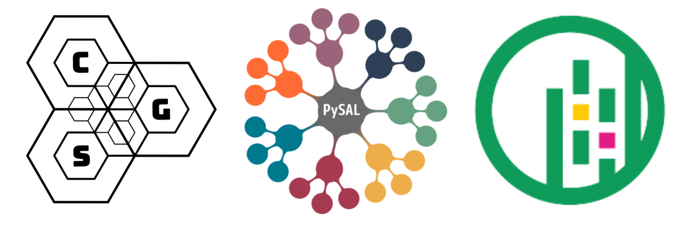
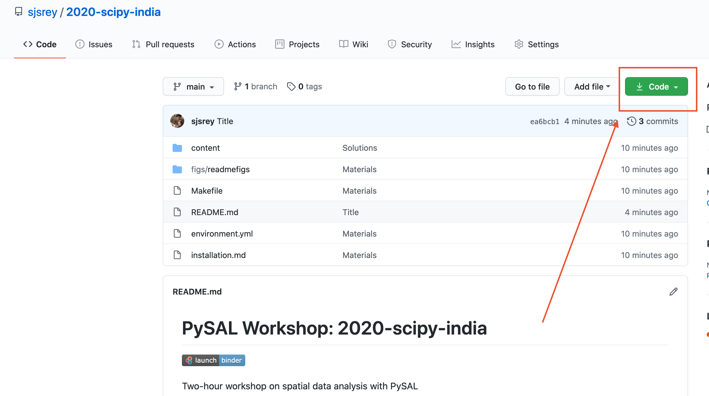

# PySAL Workshop: 2020-scipy-india

[](https://mybinder.org/v2/gh/sjsrey/2020-scipy-india/main?urlpath=lab)

Two-hour workshop on spatial data analysis with PySAL

<p align="center">

</p>

### Instructor

* Serge Rey - University of Californa, Riverside

---

## Schedule

- Geoprocessing
- Geovisualization
- Spatial Weights
- Spatial Autocorrelation Analysis


---


## Getting Started

**To get started immediately without installing or downloading anything, click the *"Launch Binder"* button at the top of this page**


If you are familiar with GitHub, you should clone or fork this GitHub repository to a specific directory. Cloning can be done by:

``` bash
git clone https://github.com/sjsrey/2020-scipy-india.git
```

If you are not using git, you can grab the workshop materials as a zip file by pointing your browser to (https://github.com/sjsrey/2020-scipy-india.git) and clicking on the green _Clone or download_ button in the upper right.



Extract the downloaded zip file to a working directory.

